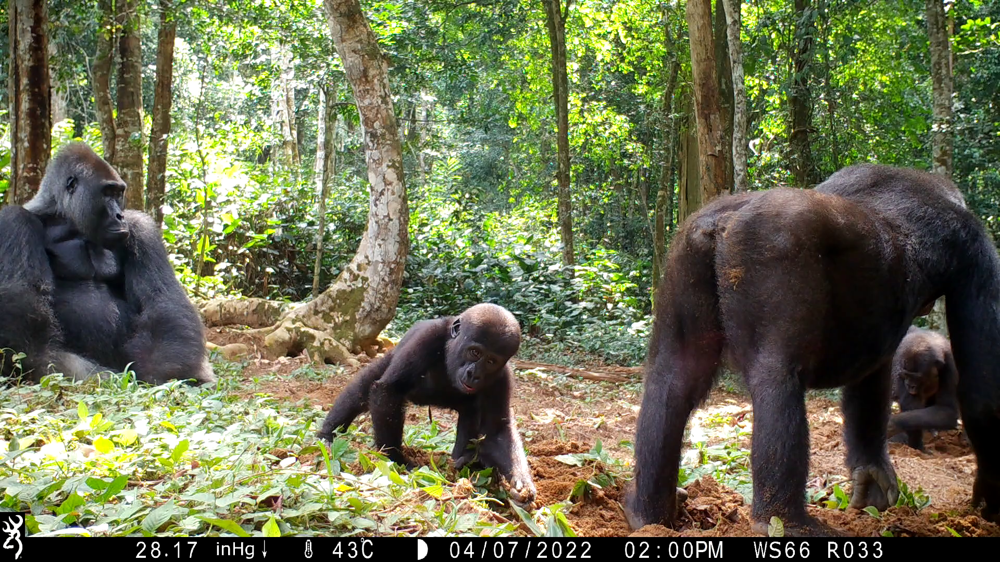
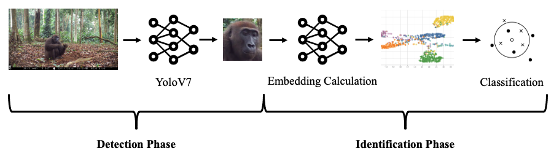

<h1 align="center">GorillaVision</h1>

<h2 align="center" style=font-size:200px>An open-set re-identification system for gorillas in the wild</h2>

<p align="center">
  
</p>

<a name="overview"></a>
## Overview

We present a system for open-set gorilla re-identification in the wild. Our system follows a two stage approach in which gorilla faces are detected with a YOLOv7 detector in the first stage, and are classified with our GorillaVision model in the second stage. We implement our classification model based on the VisionTransformer that is optimized with Triplet Loss and that computes embeddings of gorilla faces. As in many face-identification tasks, the embeddings are then used, to provide a similarity measure between the individual gorillas. Classification is then performed on these embeddings with a k-nearest neighbors algorithm. For a closed-set scenario, our approach slightly outperforms the state-of-the art YOLO detector. In the open-set scenario, our model is also able to deliver high quality results with an accuracy in the range of 60 to 80\% depending on the quality of the dataset. Given that we have many individuals with at least 6 images each, our approach achieves 89\% top-5 accuracy.

<p align="center">
  
</p>

<a name="structure"></a>
## Structure
The code for the gorillavision module is located in the reid-system/gorillavision folder. The files to run the gorillavision module or to run predictions are located in the reid-system folder. All other folder are from the <a href="https://github.com/deshwalmahesh/yolov7-deepsort-tracking">Yolov7-Deepsort Tracking</a> project. Changes to this code structure are difficult, since changing the imports of the yolov7-deepsort tracker lead to problems when importing pre-trained models.

<a name="running"></a>
## Running the Application

### Prediction
The prediction script is able to directly predict bounding boxes on images and videos if provided with a trained detection and identification model.

1. Build the docker image with `docker build -t gorilla_triplet .`
2. Provide all required arguments in the `predict.py` file in the main function. 
This includes a trained and serialized model for face and body detection, a trained and serialized model for identfication, the images and videos that you want to predict on, and a database to identify against.
3. Adapt the paths in the command below and run the docker container and prediction with 

```docker run -v  /scratch1/wildlife_conservation/:/data -v /gorilla-reidentification/:/gorilla-reidentification --gpus device=0 --ipc="host" -it gorilla_triplet predict.py```

For demo purposes `scratch1/scratch1/wildlife_conservation/` can be mounted on the server to include pretrained models (see description of models in the data section) that work without any adaption of the parameters in the `main` function.

### Evaluation Pipeline
If you want to train a model based on your own data and directly evaluate it, we reccomend using the evaluation pipeline.
This requires 3 datasets: Training data, data to create a database from, and data that is used to evaluate and compute the metrics on.

1. Adapt the gorillavision/configs/config.json file: You only need to provide your datasets in the "main" section. Additionally, you can
adapt the model to your needs. The folder you pass into is require to include 3 subfolders: "train", "db_set" and "eval". If you want to evaluate multiple datasets / splits, you can provide all folders manually under `datasets`, otherwise you can also provide a single folder that contains all datasets that should be used under `datasets_folder`.
2. Start the docker-container and run the pipeline:

```
docker run -v  /home/mydatafolder/:/data -v /home/models/:/models -v /gorilla-reidentification/reid-system:/gorilla-reidentification/reid-system --gpus device=1 --ipc="host" -it gorilla_triplet python3 identification_pipeline.py
```

If you want to evaluate multiple configs in one go, you can use `-d |directory_name|` as a paramter for the `identification_pipeline` that provides the name of a directory that contains all configs.

### Training
**Detection**
Run the "train_detection.py" with the according dataset in the docker container to create a detection model. You can run the detection with the following command: TODO

**Identification**
You can also run training and database creation individually. To do so start the docker container, provide the required arguments in the according sections (train, predict and create_db) in the config file and run "train_identification.py" or "create_identification_db.py" in the docker container.

To train the identification model, the images should be provided cropped to the gorilla and all images belonging to an individual should be stored in an according folder.

## Data
We provide some preprocessed data and models on the server. These can also be used to reproduce our results. The dataset splits are created using a custom stratified sampling with a split of 70% for training, and 30% for creating the database and evaluating against.

To create futher k-folds dataset splits you can use the `dataset_generator.py`

- Data to train and evaluate the detection model
  - Images and labels for training YOLO are loacted under `/scratch1/wildlife_conservation/data/face_detection/data`

- Data to train and evaluate the prediction model: `/scratch1/wildlife_conservation/data/gorilla_experiment_splits/k-fold-splits`
  - Open-Set: All folders ending with openset=True
  - Closed-Set: All folders ending with openset=False

- Pretrained models and database for demo purposes
  - Face detection model: `/scratch1/wildlife_conservation/demo/models/yolov7_face_model.pt`
  - Body detection model: `/scratch1/wildlife_conservation/demo/models/yolov7_body_model.pt`
  - re-id model (trained on all individuals): `/scratch1/wildlife_conservation/demo/models/identification_model.ckpt`
  - database (all individuals): `/scratch1/wildlife_conservation/demo/models/db`


<a name="contributors"></a>
### Contributors ✨

<table>
  <tr>
    <td align="center"><a href="https://github.com/rohansaw"><br /><sub><b>Rohan Sawahn</b></sub></a><br /></td>
    <td align="center"><a href="https://github.com/Lasklu"><br /><sub><b>Lukas Laskowski</b></sub></a><br /></td>
  </tr>
</table>

The tracking module is based on the following work: https://github.com/deshwalmahesh/yolov7-deepsort-tracking
This project follows the [all-contributors](https://github.com/all-contributors/all-contributors) specification. Contributions of any kind welcome!

